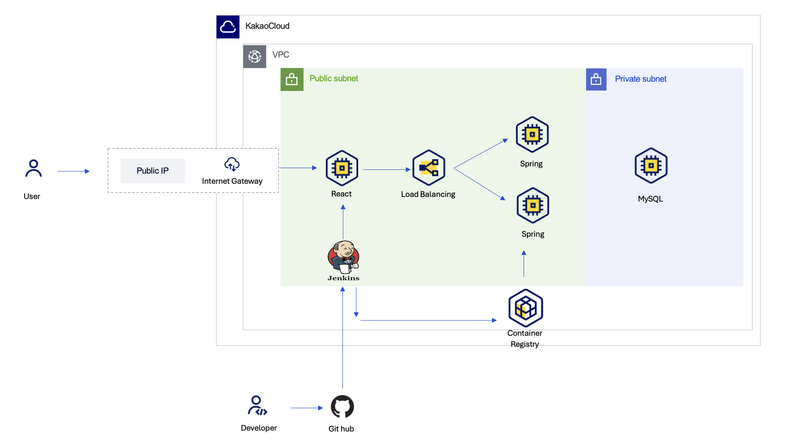

## 🎟️ TikiTaka

### Ticket Management System

## 목차
- [개발기간 및 작업 관리](#1-개발기간-및-작업-관리)
- [개발 환경](#2-개발-환경)
- [프로젝트 개요](#3-프로젝트-개요)
- [프로젝트 주요 기능](#4-프로젝트-주요-기능)
- [프로젝트 구조](#5-프로젝트-구조)
- [아키텍쳐](#6-아키텍쳐)
- [프로젝트 회고](#7-프로젝트-회고)

---

## 1. 개발기간 및 작업 관리

### 개발 기간
- 프로젝트 기간 : 2025-01-21 ~ 2025-02-12
- 기능 구현 기간: 2025-01-06 ~ 2025-02-21

### 작업 관리
- GitHub Issues와 Jira를 사용하여 지정 상황을 공유했습니다.
- 매주 주기적으로 회의를 진행하고 노션을 통해 진행사항을 공유하며 소통하였습니다.

---

## 2. 개발 환경

- **Back-end** : JAVA 17, SpringBoot 3.4.1, Spring Data JPA 3.4.1, JWT 0.12.6, Lombok 1.18.36, Mysql 8.0.34, QueryDSL 5.0
- **Infra** : Jenkins(version: 2.479.3), Docker(version: 27.5.1), VM, Object Storage, DNS, ALB, Container Registry, JMeter
- **버전 및 이슈관리** : Jira, GitHub Issues
- **협업 툴** : Discord, Notion, Jira
- **서비스 배포 환경** : https://www.tikitaka.kr/
- **디자인** : [Figma](https://www.figma.com/design/thuLRItFgpXsQCvar1PNcv/TikiTaka?node-id=1-2&p=f&t=g3uAlqGDvddWZShJ-0)
- **코드 컨벤션**: (https://www.notion.so/f1842ca6993549b2b5a51e6c1935303f?pvs=21)**

---

## 3. 프로젝트 개요

## 🔹 프로젝트 배경
현재 사내 인프라 지원 요청이 **메신저, 이메일, 전화, 구두 전달** 등 여러 채널로 이루어져 업무가 **효율적**이지 못하다고 판단했습니다 

- **요청 단일화**: 모든 이슈를 한눈에 파악하고, 처리 프로세스를 자동화하여 업무 효율 향상
- **요청 추적 관리**: 누락 방지 및 반복 문의 감소를 위해 체계적인 티켓 시스템 도입
- **진행상황 및 통계 제공**: 실시간 상태 확인 및 이력 관리, 통계 분석을 통해 업무 프로세스 개선

## 🔹 프로젝트 목적
- **통합 요청 관리**: 하드웨어, 소프트웨어, 네트워크, 계정 관리 등 모든 요청을 **한 시스템에서 접수·관리·모니터링**
- **투명성 및 책임성 강화**: 담당자 지정 및 실시간 진행 상황 공유로 **책임 소재 명확화**
- **데이터 기반 개선**: **티켓 데이터를 분석**하여 빈번한 문제 파악 및 향후 인프라 운영 최적화

---

## 4. 프로젝트 주요 기능

### 1. 요청(티켓) 관리 시스템
- **통합 요청 접수**: 하드웨어, 소프트웨어, 네트워크, 계정 관리 등 모든 지원 요청을 하나의 시스템에서 접수
- **티켓 상태 관리**: `대기중 → 진행 중 → 완료` 등 실시간 상태 업데이트
- **첨부 파일 지원**: 요청 시 관련 파일 업로드 가능

### 2. 실시간 진행상황 모니터링
- **요청자 & 담당자 대시보드**: 사용자는 본인의 요청 상태를 확인, 담당자는 할당된 티켓을 한눈에 파악
- **실시간 알림**: 요청 처리 상태 변경 시 카카오워크 알림 전송
- **업무 진행 기록**: 요청 처리 과정에서의 모든 변경 사항과 커뮤니케이션 로그 저장

### 3. 티켓에 대한 변경 로그 저장
- **티켓 내 댓글 기능**: 담당자와 요청자가 티켓 내에서 직접 소통 가능
- **서브태스크(Subtask) 생성**: 복잡한 요청을 작은 단위로 분리하여 개별 처리 가능과 진행률 표시
- **티켓 템플릿**: 반복적인 요청 유형을 템플릿으로 저장하여 빠른 생성 지원

### 4. 통계 및 보고 기능
- **요청 처리 이력 및 통계**: 담당자별, 카테고리별, 유형별 티켓 수 등 주요 지표 분석
- **이슈 패턴 분석**: 자주 발생하는 문제를 식별하여 사전 예방 조치 가능
- **월별/분기별 리포트**: 일별과 월별로 담당자가 처리 현황을 알 수 있음

### 5. 인증 및 보안 관리
- **사용자 역할 기반 접근 제어 (RBAC)**: 일반 사용자, 관리자, 담당자 등 권한별 기능 제한
- **JWT 기반 인증**: 보안 강화를 위한 JWT(Json Web Token) 기반 인증 시스템 적용

---

## 5. 프로젝트 구조

## 📂 프로젝트 구조

```plaintext
📦 src
 ├── 📂 main
 │    ├── 📂 java/com/trillion/tikitaka
 │    │    ├── 📂 attachment       # 파일 첨부 관련 기능
 │    │    ├── 📂 authentication   # 인증 및 로그인 관련 기능
 │    │    ├── 📂 category         # 티켓 카테고리 관리
 │    │    ├── 📂 global           # 전역 설정 및 공통 유틸
 │    │    ├── 📂 history          # 티켓 변경 이력 관리
 │    │    ├── 📂 infrastructure   # 인프라 관련 설정 (DB, 네트워크 등)
 │    │    ├── 📂 inquiry          # 문의 및 요청 관련 기능
 │    │    ├── 📂 notification     # 알림 기능 (이메일, 푸시 알림 등)
 │    │    ├── 📂 registration     # 사용자 등록 및 회원가입 관련 기능
 │    │    ├── 📂 statistics       # 통계 및 리포트 기능
 │    │    ├── 📂 subtask          # 서브 태스크 관리
 │    │    ├── 📂 ticket           # 티켓 관리
 │    │    ├── 📂 ticketcomment    # 티켓 댓글 기능
 │    │    ├── 📂 ticketform       # 티켓 폼 관리
 │    │    ├── 📂 tickettemplate   # 티켓 템플릿 관리
 │    │    ├── 📂 tickettype       # 티켓 타입 관리
 │    │    ├── 📂 user             # 사용자 관리 (프로필, 권한 등)
 │    │    ├── AdminInitializer.java  # 관리자 초기화 설정
 │    │    ├── TikiTakaApplication.java  # 메인 실행 파일
 │    ├── 📂 resources
 │    │    ├── application.yml         # 기본 환경설정
 │    │    ├── application-dev.yml     # 개발 환경 설정
 │    │    ├── application-local.yml   # 로컬 환경 설정
 │    │    ├── application-test.yml    # 테스트 환경 설정
 │    │    ├── logback-spring.xml      # 로깅 설정
 ├── 📂 test                            # 테스트 코드
 │    ├── 📂 java/com/trillion/tikitaka
 │    │    ├── 📂 attachment
 │    │    ├── 📂 authentication
 │    │    ├── 📂 category
 │    │    ├── 📂 global
 │    │    ├── 📂 history
 │    │    ├── 📂 infrastructure
 │    │    ├── 📂 inquiry
 │    │    ├── 📂 notification
 │    │    ├── 📂 registration
 │    │    ├── 📂 statistics
 │    │    ├── 📂 subtask
 │    │    ├── 📂 ticket
 │    │    ├── 📂 ticketcomment
 │    │    ├── 📂 ticketform
 │    │    ├── 📂 tickettemplate
 │    │    ├── 📂 tickettype
 │    │    ├── 📂 user
 ├── README.md  # 프로젝트 설명 문서
```
---

## 6. 아키텍쳐



🟡 우리 프로젝트는 **Kakao Cloud**를 기반으로 모놀리식 아키텍처를 적용한 **웹 애플리케이션**입니다.  
프론트엔드는 **React + Nginx**, 백엔드는 **Spring Boot (2개 VM, 롤링 배포 적용)**, 데이터베이스는 **MySQL**을 사용하며,  
**CI/CD 자동화**를 구축하여 효율적인 배포 환경을 구성하였습니다.


🛠️ **배포 프로세스**
1. **개발자가 GitHub에 코드를 Push**
2. **Jenkins가 CI/CD 파이프라인을 실행** (빌드 및 테스트)
3. **Spring Boot 애플리케이션을 Docker 이미지로 빌드 후 Kakao Cloud Container Registry에 업로드**
4. **배포 스크립트를 실행하여 신규 이미지를 Spring Boot VM에 배포**
5. **ALB 트래픽 가중치를 조절하여 롤링 배포 진행**
6. **배포 완료 후 정상 작동 여부 확인**

---

## 7. 프로젝트 회고

### 🔹 아쉬웠던 점
- **시간 관리 부족**: 초반 설계 미흡으로 예상치 못한 문제 발생, 일부 기능 구현 불가능
- **우선순위 설정 미흡**: 작업이 후반부에 몰려 코드 품질 저하
- **TMS 개념 부족**: 초기 이해가 어려웠으나 논의를 통해 방향성 확보
- **API 연동 지연**: 백엔드 연동 지연으로 프론트엔드가 임시 데이터로 개발 진행

### 🔹 잘했던 점
- **심층적 기획 논의**: 기능을 명확히 정의하여 시행착오 최소화
- **책임감 있는 협업**: 각자 역할을 충실히 수행하며 프로젝트 완수
- **멘탈 관리**: 촉박한 일정 속에서도 끝까지 집중하여 높은 완성도로 마무리
- **코드 리뷰 강화**: PR 승인 전 코드 리뷰 진행, 코드 충돌 최소화 및 품질 향상

### 🔹 느낀 점
- **협업 소통 중요성**: 적극적인 의견 교환이 문제 해결과 개발 방향 정립에 기여
- **테스트 및 QA 필요성**: 충분한 QA가 UI/UX 완성도에 필수적임을 깨달음
- **트러블슈팅 역량 향상**: 시스템 전반을 이해하며 문제 해결 능력 강화

### 🔹 개선할 점
- **QA 일정 구체화**: 우선순위를 정해 체계적인 테스트 진행
- **기능별 테스트 문서화**: API 응답값, UI 변화, 오류 처리 기준을 문서화
- **UI/UX 테스트 강화**: 사용자 입장에서 개선할 부분 점검
